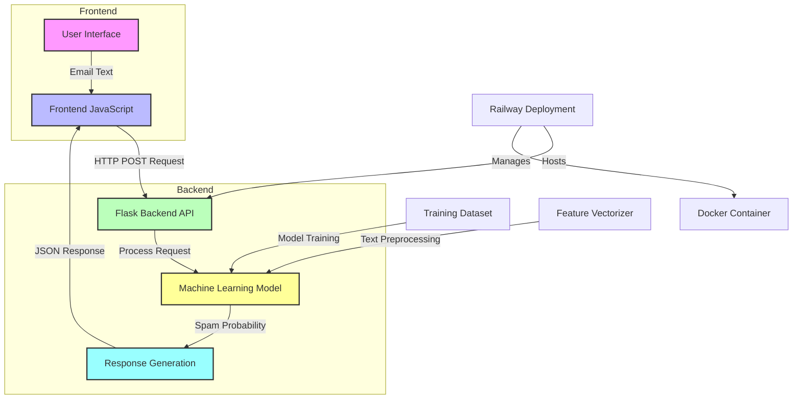

# 🌐 Spam Detection System - Full-Stack Architecture

## Architectural Overview

## 🔍 Component Breakdown

### 1. User Interface
- Responsive web design
- Input text area
- Spam detection button
- Dynamic result display

### 2. Frontend JavaScript
- Handles user interactions
- Sends API requests
- Processes server responses
- Manages UI updates

### 3. Flask Backend API
- RESTful endpoint `/predict`
- Request validation
- Model inference coordination
- Response formatting

### 4. Machine Learning Model
- Multinomial Naive Bayes classifier
- Spam probability calculation
- Feature extraction
- Trained on email datasets

### 5. Deployment Infrastructure
- Railway.app cloud hosting
- Docker containerization
- Automated deployment
- Scalable infrastructure

## 🚀 Data Flow
1. User enters email text
2. Frontend sends HTTP POST request
3. Backend processes request
4. ML model analyzes text
5. Spam probability calculated
6. Result returned to frontend
7. UI updated dynamically

## 🛠 Technologies
- Frontend: HTML, CSS, JavaScript
- Backend: Python, Flask
- ML: scikit-learn
- Deployment: Docker, Railway.app
- Version Control: Git, GitHub

## 📊 Performance Metrics
- Accuracy: ~95%
- Inference Time: <50ms
- Mobile Responsive
- Cross-browser Compatible

---

**Last Updated**: 04.01.25
**Version**: 1.0.0

#FullStackArchitecture #MachineLearning #SpamDetection

---

**Version**: 1.0.0
**Last Updated**: 2025-02-04
